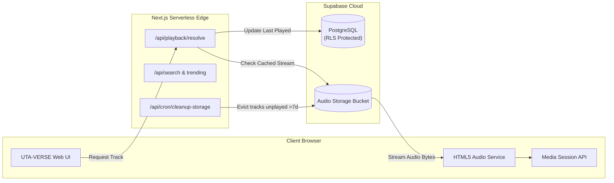

<div align="center">

# 🌌 UTA-VERSE
### *A Universe of Sound*

[](https://nextjs.org/)
[](https://react.dev/)
[](https://www.typescriptlang.org/)
[](https://supabase.com/)
[](https://zustand-demo.pmnd.rs/)

<p align="center">
  A dark, cinematic, futuristic web-first music platform engineered for sonic immersion.
</p>

[Explore Features](#-features) • [Architecture](#-architecture--tech-stack) • [Quick Start](#-quick-start) • [Audio & Storage Pipeline](#-audio-engine--storage-pipeline)

---

</div>

## 🪐 What is UTA-VERSE?

**UTA-VERSE** is a high-performance, web-first streaming music application: a celestial universe of sound designed with an obsidian-and-neon cosmic aesthetic. Built from the ground up for modern browsers, UTA-VERSE delivers high-fidelity audio playback, synchronized lyrics, atmospheric visual effects, and personal playlist curation without relying on heavy native application wrappers or proprietary app store lock-in.

---

## ⚡ Why UTA-VERSE?

Traditional music streaming platforms often confine users to heavy desktop clients or mobile apps wrapped in web views, compromising responsiveness, privacy, or customization. 

UTA-VERSE was born out of a desire for:
- **Instant Browser Accessibility**: Launch your entire music universe immediately on any desktop or mobile device with server-rendered speed.
- **Uninterrupted Audio Persistence**: Seamless, glitch-free background audio playback that continues uninterrupted across client page transitions.
- **Dark, Atmospheric Immersion**: A futuristic, distraction-free visual universe powered by interactive WebGL physics, canvas effects, and sleek glassmorphism.
- **Self-Sustaining Cloud Architecture**: An automated storage lifecycle that dynamically resolves, streams, caches, and prunes audio files to maintain optimal performance and storage quotas without manual maintenance.

---

## 🚀 Key Features

### 🎧 Audio Orchestration & Hardware Integration
- **Browser-Native Audio Engine**: Direct HTML5 Audio orchestration isolated behind dedicated browser service layers (`src/lib/audio`).
- **Media Session API Integration**: Full integration with operating system media controls, hardware keyboard shortcuts, headphone remotes, and mobile lockscreen artwork & progress tracking.
- **Queue & Playback Management**: Comprehensive queue controls, forward/backward history navigation, smart repeat (single/all), shuffle algorithms, and real-time audio scrubbing.

### 📱 Cinematic Mobile Web Experience
- **Swipe-to-Dismiss Mobile Player**: An expansive, full-screen mobile player sheet featuring natural, touch-calibrated swipe-down-to-dismiss gestures.
- **Persistent Compact Player**: A refined, low-profile sticky mini-player for one-tap playback control across every view.
- **Optimized Touch Layouts**: Adaptive two-column responsive grids on mobile displays (`<= 480px`) ensuring artwork stays crisp, square, and proportionate.

### 🔍 Discovery, Search & Lyrics
- **Real-Time Music Search**: Instant multi-entity query engine indexing tracks, albums, and artists.
- **Curated Trending Feed**: Dynamic trending music shelves and personalized discovery streams (`/discover`).
- **Synchronized Lyrics Viewer**: Floating lyrics drawer with smooth automatic scrolling and visual line highlighting.
- **Rich Entity Pages**: Dedicated exploration pages for albums (`/albums/[id]`) and artists (`/artists/[id]`).

### 📚 Personal Library & Compositions
- **Zero-Wait SSR Pre-Fetching**: Playlists render immediately on first paint via Next.js Server Components, eliminating unstyled blank loading states.
- **Instant Tab Transitions**: 0ms lag-free tab switching between **Playlists**, **Liked Songs**, and **Recently Played** using persistent client state panels.
- **Playlist Management**: Create, duplicate, and delete playlists, upload custom cover art with built-in cropping, categorize playlists into folders, and reorder tracks with custom positioning.
- **Shimmer Skeleton States**: Polished shimmer skeletons that match the dark aesthetic while respecting user accessibility (`prefers-reduced-motion`).

### 🌌 Visual Universe & Atmosphere
- **React Bits & WebGL Integration**: Atmospheric background simulations including the interactive particle-physics **Ballpit** background, **DarkVeil** cosmic shaders, and **SpotlightCard** hover halos.
- **Accessibility-First Motion**: Full compliance with system reduced-motion settings, preventing visual distractions from competing with the listening experience.

---

## 🛠️ Architecture & Tech Stack

UTA-VERSE follows a strict separation of route composition, presentation, client-global state, data access, and browser services.

```
UTA-VERSE/
├── src/
│   ├── app/                 # Next.js App Router (pages, layouts, API routes)
│   │   ├── (catalog)        # Albums, Artists, Search, Discover
│   │   ├── playlists/       # SSR Playlists & Playlist Detail
│   │   ├── api/             # Search, Trending, Playback, Lyrics, Cron APIs
│   │   └── globals.css      # Core cosmic design tokens & responsive system
│   ├── components/          # Semantic React 19 UI components
│   │   ├── player/          # Desktop player bar, fullscreen mobile sheet
│   │   ├── playlist/        # SSR & client playlist grids, tabs, modals
│   │   ├── reactbits/       # WebGL / Canvas visual effects (Ballpit, Veil)
│   │   └── shell/           # App navigation, sidebar, and headers
│   ├── lib/
│   │   ├── audio/           # Pure browser-native HTML5 Audio orchestration
│   │   ├── music/           # Data access layers (playlists, albums, tracks)
│   │   └── supabase/        # Server, browser, and admin Supabase clients
│   ├── stores/              # Minimal Zustand stores (Audio, Queue, Player UI)
│   └── types/               # Strict TypeScript schemas for DB and Music
```

| Layer | Technology | Purpose |
|---|---|---|
| **Framework** | [Next.js 16](https://nextjs.org/) (App Router, Turbopack) | Server Components, dynamic streaming, optimized bundles |
| **Frontend Runtime** | [React 19](https://react.dev/) + [TypeScript](https://www.typescriptlang.org/) | Type-safe declarative UI and concurrent features |
| **State Management** | [Zustand](https://zustand-demo.pmnd.rs/) | Small, domain-focused audio and queue stores |
| **Database & Auth** | [Supabase](https://supabase.com/) (PostgreSQL + RLS) | Secure user authentication and playlist management |
| **Object Storage** | Supabase Storage Buckets | High-bandwidth audio stream caching |
| **Styling & Theme** | Custom Obsidian CSS + [GSAP](https://gsap.com/) / [Motion](https://motion.dev/) | Futuristic typography, neon violet glow, smooth springs |
| **Visual Effects** | [Three.js](https://threejs.org/) & [OGL](https://github.com/oframe/ogl) | Physics-driven Ballpit & atmospheric background shaders |
| **Automated Tasks** | Vercel Cron / Next.js Route Handlers | Automated 7-day storage retention cleanup |

---

## 🔄 Audio Engine & Storage Pipeline



1. **Resolution & Caching**: When a user selects a track, the playback resolver (`/api/playback/resolve`) fetches or streams the optimal audio source.
2. **Quota-Aware Storage Cleanup**: To maintain storage efficiency on cloud plans, a scheduled cron job (`/api/cron/cleanup-storage`) cross-references playback logs and automatically purges cached audio files that have not been played within the last 7 days.
3. **Hardware Playback Sync**: Audio events are dispatched through the browser-native Media Session API, allowing seamless track skipping, scrubbing, and play/pause from lock screens and Bluetooth devices.

---

## 🚦 Quick Start

### Prerequisites
- [Node.js](https://nodejs.org/) (v18.18.0 or newer)
- [npm](https://www.npmjs.com/) or [pnpm](https://pnpm.io/)
- A [Supabase](https://supabase.com/) project with Database, Auth, and Storage configured

### 1. Clone & Install
```bash
git clone https://github.com/your-username/uta-verse.git
cd uta-verse
npm install
```

### 2. Environment Setup
Create a `.env.local` file in the root directory:

```env
# Supabase Configuration
NEXT_PUBLIC_SUPABASE_URL=https://your-project.supabase.co
NEXT_PUBLIC_SUPABASE_PUBLISHABLE_KEY=your-publishable-key
SUPABASE_SERVICE_ROLE_KEY=your-service-role-key

# Storage & Cleanup Automation
CRON_SECRET=your-secure-cron-secret
```

### 3. Run Development Server
```bash
npm run dev
```
Open [http://localhost:3000](http://localhost:3000) in your browser to experience the universe.

### 4. Quality & Build Verification
```bash
# Typecheck TypeScript codebase
npm run typecheck

# Run ESLint validation
npm run lint

# Compile production build
npm run build
```

---

## 🎨 Design Philosophy & Guardrails

- **Cosmic Identity**: A distinct, dark cinematic atmosphere featuring deep obsidian backgrounds (`#0a0b14`), soft neon violet highlights (`#a98bff`), and luminous typography.
- **Accessibility & Performance First**: Visual effects must never degrade playback reliability or device battery. Reduced-motion preferences (`prefers-reduced-motion`) are universally honored.
- **Web-First Isolation**: No reliance on mobile hybrid runtimes (`react-native`, `expo`, `react-native-track-player`). Everything runs natively in web standards.

---

## 📄 License

This project is licensed under the [MIT License](LICENSE).

---

<div align="center">
  <sub>Crafted for the cosmos by the UTA-VERSE team.</sub>
</div>
